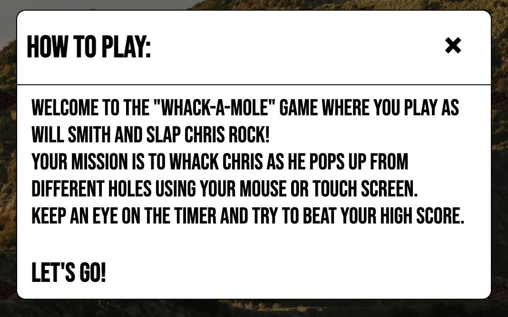
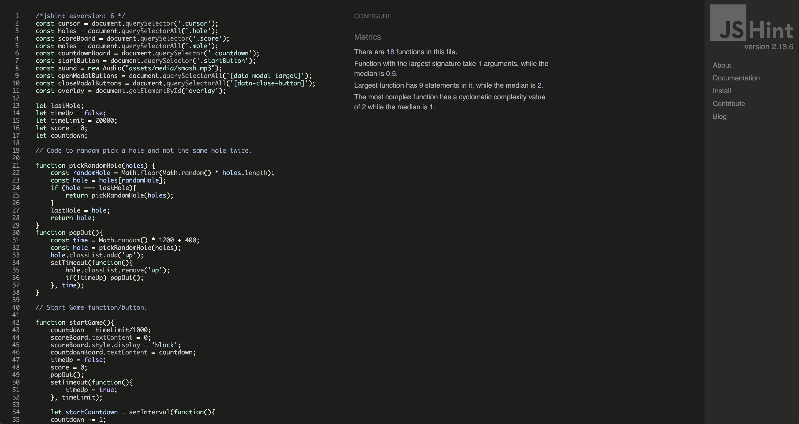

# WHACK-A-MOLE

Whack a Mole is a classic arcade game that was invented in 1976 by Aaron Fechter. The game consists of a cabinet with holes, and players use a mallet to hit toy moles that pop up randomly from the holes.

This is a submission to the Code Institute Project Portfolio 2, the aim was to create a basic yet efficient website with well-implemented JavaScript, so i decided to make a "whack-a-mole"-game with a little twist, you play as Will Smith and you slap Chris Rock that pops up.
The project was designed to be simple yet functional, making it a perfect opportunity to apply some of the **JavaScript** concepts covered in the course so far.

The live website can be found [here](https://charlieapell.github.io/whack-a-mole/).

## Design

### Wireframes

## Features 

### Existing Features

- __Header__

  - Featured at the top of the game, the header is integrated with the picture showing the name of the game "Whack-a-mole"

- __The game-area__

  - The section where the action happens, small dirt piles where chris rock pops out.
  - In the middle, the big white numbers are the score and the smaller numbers in red shows the time left.

- __Buttons__

  - At the bottom of the game-area there are two buttons, one to start the game with and one for "how to" with a brief information about the game and how to play

- __The How to play__

  - This section allows the user to read about the game and how to play it.

### Features Left to Implement

- In the future I would like to expand this game with different gameplays and add different levels of difficulties.  

## Testing 

- I tested that this page works in different browsers: Chrome, Firefox, and Safari.

- The page is responsive and contains all the functions across different screen sizes using the dev tools device toolbar.

- I confirmed that all of the content is readable and easy to understand.

- I confirmed that the webpage are easy to read and accessible by running it through lighthouse in devtools

## Bugs

### Solved Bugs
- I had some trouble when I deployed my project to Github Pages, nothing worked and it was because I had used absolute file paths.
- I had some trouble with the media queries.
- I wasn't happy with the Lighthouse result so I converted the background image from png to Webp to get a higher score in performance.

### Unfixed Bugs
- No reports of bugs.

### Validator Testing 

- HTML
  - No errors were returned when passing through the official [W3C validator](https://validator.w3.org/nu/?doc=https%3A%2F%2Fcharlieapell.github.io%2Fwhack-a-mole%2F)

  
- CSS
  - No errors were found when passing through the official [(Jigsaw) validator](https://jigsaw.w3.org/css-validator/validator?uri=https%3A%2F%2Fcharlieapell.github.io%2Fwhack-a-mole%2F&profile=css3svg&usermedium=all&warning=1&vextwarning=&lang=sv)
  
  

- JavaScript
  - No errors were returned when passing through the official [JSHint validator](https://jshint.com/) 
  
  

## Deployment

- The site was deployed to GitHub pages. The steps to deploy are as follows: 
  - In the GitHub repository, navigate to the Settings tab 
  - From the source section drop-down menu, select the Master Branch
  - Once the master branch has been selected, the page will be automatically refreshed with a detailed ribbon display to indicate the successful deployment. 

The live link can be found [here](https://charlieapell.github.io/whack-a-mole/)

## Technologies Used

### Languages Used

HTML, CSS, Javascript

### Frameworks, Libraries & Programs Used

- Balsamiq - Used to create wireframes.

- Gitpod - For version control.

- Github - To save and store the files for the website.

- Google Fonts - To import the fonts used on the website.

- Google Dev Tools - To troubleshoot and test features, solve issues with responsiveness and styling.

- [Tiny PNG](https://tinypng.com/) To compress images.

- [Birme](https://www.birme.net/?target_width=640&target_height=480&no_resize=true&image_format=webp) To compress images in the webp format.

- [Am I Responsive?](http://ami.responsivedesign.is/) To show the website image on a range of devices.

## Credits 

### Content

- I followed the tutorial from [Franks Laboratory](https://www.youtube.com/watch?v=RTb8icFiSfk&ab_channel=Frankslaboratory) and [Code with Ania Kubów](https://www.youtube.com/watch?v=rJU3tHLgb_c&t=1s&ab_channel=CodewithAniaKub%C3%B3w) for the layout of the game.
- I watched [Web Dev Simplified](https://www.youtube.com/watch?v=MBaw_6cPmAw&ab_channel=WebDevSimplified) tutorial for the "how to"-pop up.
- I watched [Angel Brace](https://www.youtube.com/watch?v=b20YueeXwZg&ab_channel=AngleBrace) tutorial for the cursor and sound effect.

### Media

- The background image with the Hollywood sign were downloaded from [Unsplash](https://unsplash.com/photos/VJ5i5ARz6jc) and was taken by [Gabe](https://unsplash.com/@whileimout)
- The image was then cropped and designed in [Canva](https://www.canva.com/)
- The picture of Will Smith were taken from [DeviantArt](https://www.deviantart.com/pedroaugusto14/art/Will-Smith-slap-PNG-911334503)
- The picture of Chris Rock were taken from [Celebrities InfoSeeMedia](https://celebs.infoseemedia.com/chris-rock/chris-rock/)
- The picture of sad Chris Rock were taken from [Tenor](https://tenor.com/sv/view/sad-chris-rock-total-blackout-the-tamborine-extended-cut-emotional-crying-gif-20108050)
- The font is called Bebas Neue and were taken from [Google Fonts](https://fonts.google.com/specimen/Bebas+Neue?query=bebas+neue)
